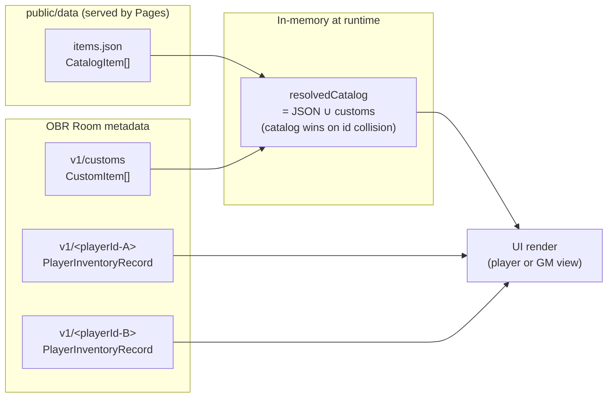
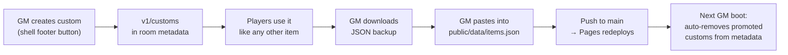

# OBR Inventory

Per-player inventory tracker for Owlbear Rodeo.

## Features

- Each player sees their own inventory; the GM sees all of them via tabs.
- Collapsible categories with animated expand/collapse, name-only search.
- Two view modes — toggle in the header (▦ / ☰) between the dense **list** and a Baldur's Gate-style **grid**: square cells with overlaid count badges, alphabetized within each category, hover for a rarity-colored tooltip. The choice persists per browser.
- Item names tinted by rarity (uncommon/rare flat color; very-rare/legendary add a soft glow); list rows carry a colored left-stripe and grid cells a colored border for the same signal at a glance.
- Click (left or right) any row or grid cell → description popover (rarity-titled, with icon, weight, description, and zoom-out / zoom-in controls). When the item is from your own inventory the popover surfaces inline `−` / `×N` / `+` / `🗑` controls (with the same `+1` / `−1` float as the list view) plus a **Transfer…** button. Right-click the popover (or click outside / press Esc) to dismiss.
- Popover zoom steps through six discrete levels (0.85× → 1.75×); the chosen level persists per browser, and the popover re-clamps inside the iframe at every step.
- Visual feedback on every state change — count pulse + scale, floating "+1" / "−1", row/cell glow on inc/dec/add. Removes pulse amber and collapse out. Items received via transfer get a louder pulse with a name flash and auto-scroll the row/cell into view; the row's category auto-expands if it was collapsed. Honors `prefers-reduced-motion`.
- Transfer announcements broadcast to everyone in the room: the recipient sees `Alice gave you 3× Healing Potion`; observers see `Alice just transferred 3× Healing Potion to Bob`.
- The description popover is the sole edit surface — list rows and grid cells are read-only chrome. Currency stays editable inline and accepts `+45` / `-20` deltas.
- Decrementing to 0 keeps the row visible (a "ghost" you can re-stock with +); the trashcan button is the explicit way to drop a row entirely.
- Add-to-inventory dialog opens with all categories collapsed (the catalog is 305+ items); typing in the search auto-expands matching groups, and clearing the search restores the prior state.
- Color-coded denominations on the gold strip (pp/gp/sp/cp).
- GM-only "Create custom item" for one-off items not in the catalog (e.g., "you find a flower"); they live in room metadata, behave like normal items, and auto-clean up after promotion to the canonical catalog.
- 5 KB room-metadata cap shared between inventories and customs, with a GM-side meter and over-cap modal.
- GM-only JSON backup download — fully hydrated against the catalog, includes custom items.

## How it works

The extension is a single popover, role-aware: one bundle, one boot path, the UI it mounts depends on whether the local user is a GM or a player. State lives in three places — a JSON catalog served from the same origin as the extension, OBR's room metadata for per-player gear and shared customs, and an ephemeral in-memory merge of the two:



A player's view only mounts their own inventory record. The GM's view mounts a tab strip over every record in the room plus their own, with a storage-cap meter, a JSON download icon, and a customs management panel.

## Dev

```bash
npm install
npm run dev      # vite dev server (CORS configured for owlbear.rodeo)
npm test         # vitest run
npm run build    # tsc + vite build → dist/
```

### Testing in OBR locally (without deploying)

1. `npm run dev` (vite serves on `http://localhost:5173`). The catalog ships in `public/data/items.json` and is served by the same origin — no separate hosting is needed.
2. In OBR, Settings → Extensions → Add Custom Extension, paste `http://localhost:5173/manifest.dev.json`. That manifest points the icon and popover URLs at localhost; edits to source and to `public/data/items.json` both hot-reload.
3. The production `manifest.json` (pointing at Pages) stays unchanged for real deploys.

### Item catalog

Items live in `public/data/items.json`. Each entry follows the schema documented in `docs/superpowers/specs/2026-05-01-obr-inventory-design.md` §5.1. Add a new item:

```bash
node scripts/add-item.mjs              # prints a stub with a fresh nano-id
node scripts/add-item.mjs --validate   # checks required fields, dupes
```

The relative `DEFAULT_CATALOG_URL` (`./data/items.json` in `src/constants.ts`) resolves against whatever URL loaded the extension, so the same code works in dev (localhost) and prod (GitHub Pages).

### Custom items (GM)

The GM can spin up an item mid-session without touching the catalog repo. Click "+ Create item" in the inventory shell footer (visible only to GMs), fill in a name + category + description (rarity / weight / image URL are optional), and save. The item is stored under `com.abottchen.obr-inv/v1/customs` in room metadata and resolved into a unified catalog at runtime, so it shows up in search, descriptions, transfers, and the export.

Promotion to the canonical catalog is a deliberately manual workflow, but the cleanup is automatic:



Spec: `docs/superpowers/specs/2026-05-01-custom-items-design.md`.

## Deploy

GitHub Actions deploys `dist/` to Pages on push to `main`. Manifest URL:

```
https://abottchen.github.io/obr-inv/manifest.json
```

Add the manifest URL to OBR via Settings → Extensions → Add Custom Extension.

CI for PRs and feature branches runs `npm test` + `npm run build` (see `.github/workflows/test.yml`).

## Known limitations

- No in-app override for `DEFAULT_CATALOG_URL`. The spec calls for a GM-panel field to point at a different catalog per room; that UI hasn't been built yet. Until then, the only way to use a non-default catalog is to write the override directly to room metadata under `com.abottchen.obr-inv/config = { catalogUrl: "..." }`.
- Drag-and-drop in the Add dialog is best-effort — if OBR's iframe drops the drop event, double-click is the reliable fallback.
