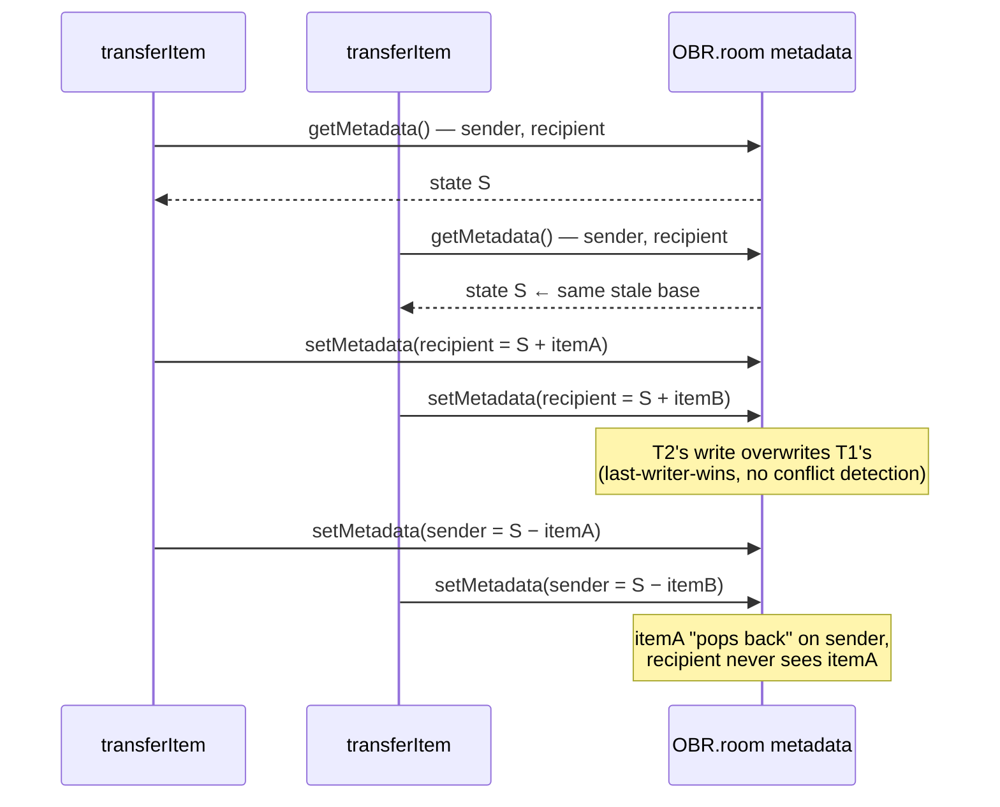
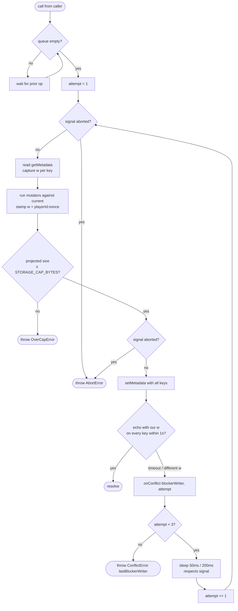
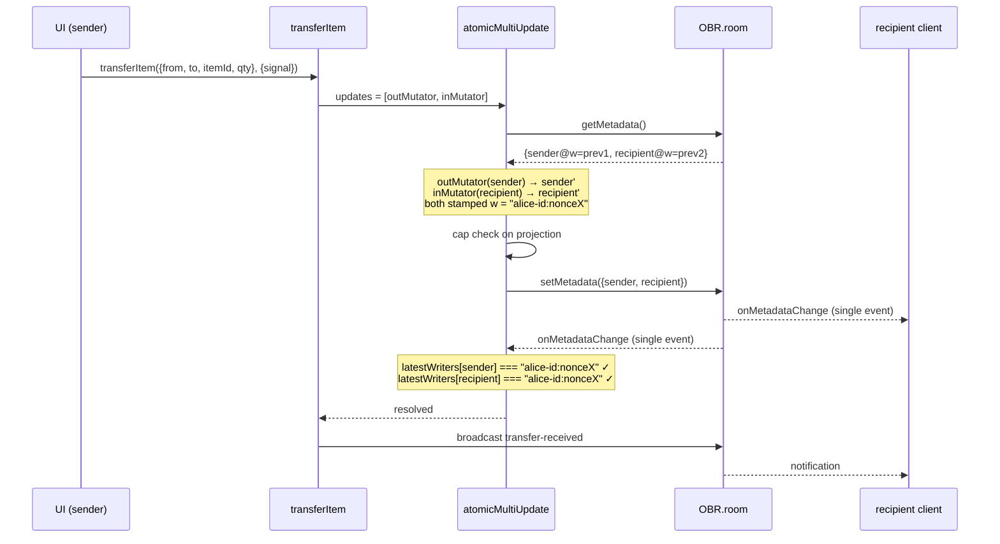

# Atomic Inventory Updates — Feature Spec

**Status:** Draft, pending implementation
**Date:** 2026-05-02
**Author:** Adam (with Claude)
**Builds on:** [`2026-05-01-obr-inventory-design.md`](2026-05-01-obr-inventory-design.md)

## 1. Purpose

Eliminate the data-loss bug where rapid back-to-back transfers (and concurrent edits from multiple clients) silently overwrite each other. Today, `transferItem` reads sender and recipient outside any critical section, so two transfers started in quick succession both base their writes on the same stale snapshot — the second write clobbers the first, items "pop back" on the sender, and the recipient never sees them despite a successful broadcast.



The goal is a system where every inventory mutation is atomic with respect to other mutations on the same records, regardless of which client initiated them, with a deterministic user-facing endpoint for every action.

## 2. Goals and non-goals

### Goals

- A transferred item is guaranteed to disappear from the sender and appear with the recipient as a single observable state change.
- Concurrent edits from any number of clients converge to a consistent inventory state. No silent loss.
- Every action terminates within a bounded wall-clock budget — success, failure, or user-cancelled — and never leaves the UI stuck on a spinner.
- The user can cancel any in-flight action and the UI returns to a known state within ≤2s of pressing Cancel.
- Works with **no GM session present**. Players must be able to use the inventory reliably without anyone else logged in.
- Apply the same correctness guarantees to all inventory-mutating writes, not just transfers (adds, deletes, ensure, customs editor, GM panel actions, currency adjustments).

### Non-goals

- Server-side enforcement. We work within OBR's metadata API as it exists: last-writer-wins `setMetadata`, `getMetadata` cache reads, `onMetadataChange` echoes, multi-key writes in one call.
- Operation-log / CRDT-style merge semantics. Records remain whole-state snapshots; conflicts are resolved by retry, not merge.
- Optimistic UI updates that show the change before the server confirms. Spinner shows from click; row updates when the echo lands.
- Persistent operation history or audit trail. A failed transfer leaves no trace beyond what currently exists.
- Cancelling other clients' in-flight operations. Cancel only affects the local action.

## 3. Decisions

| Topic | Decision |
|---|---|
| Concurrency model | Optimistic concurrency control. Each record carries a single `w` (writer) field — `<playerId>:<nonce>`. Writers detect conflicts by comparing the echoed `w` to the value they stamped. No `version` field — OBR's `setMetadata` has no compare-and-swap, so a version number wouldn't participate in any decision; the per-write nonce alone is what makes uniqueness work. |
| Atomicity across keys | Multi-key `setMetadata({k1, k2})` for transfers, so sender and recipient updates land as one server-side write. No more half-completed transfers needing rollback. |
| Self-race protection | Single global FIFO queue inside the atomic helpers serializes the entire read-modify-write-echo cycle for every mutation. Replaces the existing per-key queue in `metadata.ts`. |
| Writer format | `<OBR.player.id>:<8-char-nonce>`. The player ID prefix gives debug/UI value (we can map it back to a player name); the nonce suffix guarantees per-attempt uniqueness even across two tabs of the same player. |
| Blocker reporting | When a retry fires because the echo carried a different writer, the atomic helper surfaces the conflicting writer to the UI via an `onConflict` callback. The overlay parses the player ID, looks up the player's name, and updates its message to "Waiting on update from `<name>`…". On final failure, the toast names the last blocker. |
| Toast surface | `OBR.notification.show(text, level)` — same primitive `ui-transfer.ts` already uses. |
| Retry budget | 3 attempts max, 1s echo timeout per attempt, 50ms / 200ms backoff between attempts. Worst-case wall time ~3.5s. |
| Hard cap | 5s overlay timeout. If the operation hasn't resolved by then, force-close with "Update conflict — please try again" and trigger an inventory re-read. |
| Cancel | Every operation accepts an `AbortSignal` checked at every `await` point. UI cancel button calls `AbortController.abort()`. |
| UI affordance | Single in-app overlay with spinner, descriptive text, and Cancel button. Inventory UI behind it is pointer-events disabled. |
| Migration | Legacy records (no `w` field) read as `w: ""`. The first write stamps the new envelope. No explicit data backfill. |
| `CustomItemsRecord` shape | Wrap in `{ w, items }` envelope. Reads of legacy bare-array shape are tolerated for one release. |

## 4. Data model

### 4.1 Wire format — before and after

The extension owns three keys in `OBR.room.metadata`. Two of them gain a writer envelope; the third is unchanged.

| Key | Shape today | Touched by | Change |
|---|---|---|---|
| `com.abottchen.obr-inv/v1/<playerId>` | `PlayerInventoryRecord` (object) | `writeRecord`, `ensureRecord`, `deleteRecord`, `transferItem` | + `w` field |
| `com.abottchen.obr-inv/v1/customs` | `CustomItem[]` (bare array) | `writeCustoms` | wrapped in `{ w, items }` envelope |
| `com.abottchen.obr-inv/config` | `ExtensionConfig` `{ catalogUrl: string }` | read-only at boot, set out-of-band by GM | unchanged — not on a mutation path |

The `w` value is `<OBR.player.id>:<8-char-nonce>`. Player ID prefix is for debug/UI value (we can map back to a player name); the nonce suffix guarantees per-attempt uniqueness even across two tabs of the same player.

#### Player inventory record — `com.abottchen.obr-inv/v1/<playerId>`

**Today:**
```json
{
  "name": "Alice",
  "color": "#ff5577",
  "items": [["abc123", 3], ["def456", 1]],
  "currency": { "pp": 0, "gp": 12, "sp": 4, "cp": 0 }
}
```
Size: **123 bytes**.

**After:**
```json
{
  "w": "aBc123dEf456gHi7:V1StGXR8",
  "name": "Alice",
  "color": "#ff5577",
  "items": [["abc123", 3], ["def456", 1]],
  "currency": { "pp": 0, "gp": 12, "sp": 4, "cp": 0 }
}
```
Size: **155 bytes** (+32).

#### Customs — `com.abottchen.obr-inv/v1/customs`

**Today** (the legacy bare-array shape):
```json
[
  { "id": "custom-flower", "name": "Wildflower", "category": "Misc", "icon": "🌸", "description": "A small purple flower." }
]
```
Size: **121 bytes**.

**After:**
```json
{
  "w": "aBc123dEf456gHi7:V1StGXR8",
  "items": [
    { "id": "custom-flower", "name": "Wildflower", "category": "Misc", "icon": "🌸", "description": "A small purple flower." }
  ]
}
```
Size: **164 bytes** (+43).

#### Config — `com.abottchen.obr-inv/config`

Unchanged. Stays as `{ "catalogUrl": "..." }`. Read once at boot in `main.ts`; never mutated by the extension's write paths, so it doesn't need versioning.

#### Cap impact for a typical room (6 players + customs)

| | Overhead | % of 5120-byte cap |
|---|---|---|
| 6 player records + 1 customs envelope | 6 × 32 + 43 = **235 B** | 4.6% |

(Player ID length assumed ~16 chars based on OBR's typical IDs. ±a few bytes per record if real IDs differ.)

### 4.2 TypeScript types

```ts
export interface WriterStamp {
  w: string;     // "<playerId>:<8-char-nonce>" — empty string for legacy reads
}

export interface PlayerInventoryRecord extends WriterStamp {
  name: string;
  color: string;
  items: InventoryEntry[];
  currency: Currency;
}

export interface CustomItemsEnvelope extends WriterStamp {
  items: CustomItem[];
}
```

`CustomItemsRecord` (the existing top-level array alias) is kept as `CustomItem[]` for in-memory use; only the persisted shape becomes the envelope.

### 4.3 Read-side compatibility

`getRecord` and `getCustoms` accept the legacy shape and synthesize a missing `w` as `""`. The empty string can never collide with a real writer (which always contains a `:`), so the conflict-detection check still works for legacy → new transitions. Once any client writes, the shape is canonical going forward.

### 4.4 Writer parsing helper

```ts
export function parseWriter(w: string): { playerId: string | null; nonce: string } {
  const colon = w.indexOf(":");
  if (colon < 0) return { playerId: null, nonce: w };
  return { playerId: w.slice(0, colon), nonce: w.slice(colon + 1) };
}
```

Used by the UI to map a conflicting writer back to a player name when displaying retry/failure messages.

## 5. Components

### 5.1 New module: `src/atomic.ts`

The only place that knows about writer-stamping, retries, echoes, and cancellation. Pure I/O coordination — no business logic about what an inventory contains.

```ts
export interface AtomicUpdateOptions {
  signal?: AbortSignal;
  description: string;                                       // for the overlay
  onConflict?: (info: { blockerWriter: string; attempt: number }) => void;
}

export type Mutator<T> = (current: T | null) => T | null;
// Returning null means "delete this key"; receiving null means "no current value"

export async function atomicUpdate<T>(
  key: string,
  mutate: Mutator<T>,
  opts: AtomicUpdateOptions,
): Promise<T | null>;

export async function atomicMultiUpdate(
  updates: Array<{ key: string; mutate: Mutator<unknown> }>,
  opts: AtomicUpdateOptions,
): Promise<void>;
```

Both helpers route through a **single module-level FIFO queue** so only one mutation runs at a time per client. The queue itself respects `signal` — a cancelled operation is removed from the queue without running.

The writer nonce is generated once per attempt: `${OBR.player.id}:${randomNonce()}` where `randomNonce()` returns 8 random base62 characters.



Internal flow per attempt:
1. `throwIfAborted(signal)`
2. Read current state via `OBR.room.getMetadata()`, capture each key's `w`
3. Run mutators against current payloads; stamp `w = ${OBR.player.id}:${randomNonce()}` on each result (same writer for all keys in a multi-key update — that's how we tell "all our writes landed together")
4. **Storage cap check** — project the full owned-metadata footprint with the new payloads, throw `OverCapError` if it would exceed `STORAGE_CAP_BYTES`. (Replaces the projection logic currently in `metadata.ts:writeRecord`.)
5. `throwIfAborted(signal)`
6. Single `setMetadata` call with all updated keys
7. Wait for `onMetadataChange` event(s) to echo each key with our `w` — `Promise.race` against 1s timeout and `signal`
8. If all keys echoed our `w` → success. Otherwise → call `opts.onConflict({ blockerWriter, attempt })` with the conflicting writer (pick the first key whose echoed `w` doesn't match ours), then retry from step 1
9. After 3 attempts without success → throw `ConflictError(attempts, lastBlockerWriter)`

Constants exported for testability:
```ts
export const MAX_ATTEMPTS = 3;
export const ECHO_TIMEOUT_MS = 1000;
export const BACKOFF_MS = [50, 200];  // length = MAX_ATTEMPTS - 1
export const HARD_CAP_MS = 5000;
```

### 5.2 Echo tracker (singleton inside `atomic.ts`)

A module-level subscription captures the latest writer seen for every key. Waiters are predicate functions evaluated on every metadata change:

```ts
const latestWriters = new Map<string, string>();  // key → most recent w field seen
const waiters = new Set<() => boolean>();          // predicate; returns true when satisfied

OBR.room.onMetadataChange((md) => {
  for (const [k, v] of Object.entries(md)) {
    latestWriters.set(k, (v as WriterStamp | null)?.w ?? "");
  }
  for (const w of [...waiters]) {
    if (w()) waiters.delete(w);
  }
});
```

`atomicUpdate` after `setMetadata`:
1. First check `latestWriters` synchronously — handles the case where the echo lands before we register (rare but possible).
2. If not yet matching, register a predicate that checks `keys.every(k => latestWriters.get(k) === ourWriter)` and resolves the awaiting promise when true.
3. Race against the 1s echo timeout and the `AbortSignal`; remove the predicate from `waiters` on either.

### 5.3 `src/metadata.ts` — refactored helpers

Replace the body of each writer function with a thin call into `atomicUpdate`/`atomicMultiUpdate`. The existing per-key `enqueue` helper is removed — global FIFO ordering and storage-cap projection both move into `atomic.ts`.

```ts
export function writeRecord(
  playerId: string,
  mutate: Mutator<PlayerInventoryRecord>,
  opts: AtomicUpdateOptions,
): Promise<PlayerInventoryRecord | null> {
  return atomicUpdate(recordKey(playerId), mutate, opts);
}
```

Note the API shift: `writeRecord` now takes a **mutator function**, not a finished record. Callers express *what change they want*, not *what the new state should be*. This is essential — between the caller's read and the actual write, retries may re-read newer state, and the mutator must run against that fresh base each attempt.

`writeCustoms`, `ensureRecord`, and `deleteRecord` follow the same pattern. `deleteRecord` returns `null` from its mutator.

### 5.4 `src/transfer.ts` — refactored



```ts
export async function transferItem(
  req: TransferRequest,
  opts: AtomicUpdateOptions,
): Promise<void> {
  await atomicMultiUpdate([
    {
      key: recordKey(req.fromPlayerId),
      mutate: (sender) => {
        if (!sender) throw new Error(`Sender has no inventory record`);
        return applyTransferOut(sender as PlayerInventoryRecord, req.itemId, req.qty);
      },
    },
    {
      key: recordKey(req.toPlayerId),
      mutate: (recipient) => {
        if (!recipient) throw new Error(`Recipient has no inventory record`);
        return applyTransferIn(recipient as PlayerInventoryRecord, req.itemId, req.qty);
      },
    },
  ], opts);

  const note: TransferReceivedMessage = { ... };
  await OBR.broadcast.sendMessage(BROADCAST_CHANNEL, note, { destination: "ALL" });
}
```

The rollback block in the current `transferItem` goes away — multi-key `setMetadata` is atomic at the server, so a half-completed transfer is no longer possible. `OverCapError` still surfaces from inside `atomicMultiUpdate` and broadcasts to the GM unchanged.

`applyTransfer` is split into `applyTransferOut` (sender side) and `applyTransferIn` (recipient side) so each mutator only touches one record.

### 5.5 New module: `src/ui-overlay.ts`

The only UI surface that owns the "operation in flight" state. Singleton.

```ts
export interface ShowOverlayOpts {
  description: string;          // "Transferring 3× Longsword to Alice…"
  onCancel: () => void;
}

export function showOverlay(opts: ShowOverlayOpts): void;
export function setOverlayState(state: "working" | "cancelling"): void;
export function setOverlayDescription(text: string): void;   // for retry messages
export function closeOverlay(): void;
```

DOM: a fixed-position `<div>` over the inventory pane (not full-viewport — OBR's chrome stays interactive), pointer-events: all on itself, with a sibling backdrop that disables clicks on the inventory UI behind. Spinner + text + Cancel button. ESC also triggers cancel.

Hard cap: `showOverlay` starts a 5s timer; on fire, calls `onCancel` if still open and shows a transient toast "Update conflict — please try again."

`setOverlayDescription` lets callers swap the visible message during retries (e.g., from "Transferring…" to "Waiting on update from Bob…") without rebuilding the overlay.

### 5.6 Wiring in callers

Every UI call site that mutates inventory follows this shape:

```ts
const ac = new AbortController();
const baseDescription = `Transferring ${qty}× ${itemName} to ${recipient.name}`;
showOverlay({ description: baseDescription, onCancel: () => ac.abort() });

try {
  await transferItem(req, {
    signal: ac.signal,
    description: baseDescription,
    onConflict: ({ blockerWriter }) => {
      const { playerId } = parseWriter(blockerWriter);
      const blockerName = playerId ? records[playerId]?.name : null;
      setOverlayDescription(blockerName
        ? `Waiting on update from ${blockerName}…`
        : `Update conflict — retrying…`);
    },
  });
  closeOverlay();
} catch (err) {
  closeOverlay();
  if (err instanceof AbortError) {
    showToast("Cancelled");
  } else if (err instanceof ConflictError) {
    const { playerId } = parseWriter(err.lastBlockerWriter ?? "");
    const blockerName = playerId ? records[playerId]?.name : null;
    showToast(blockerName
      ? `Couldn't apply your change — kept conflicting with ${blockerName}'s updates. Please try again.`
      : `Update conflict — please try again.`);
  } else if (err instanceof OverCapError) {
    /* existing handling */
  } else {
    throw err;
  }
}
```

Two cosmetic notes:

- The overlay description rolls forward only — once we've shown "Waiting on Bob…" we don't revert to the original description if a later attempt has a different blocker. We do update if the blocker changes (e.g., "Waiting on Carol…").
- If the blocker is the local player (their own other tab), display "Waiting on your other session…" so the message reads naturally.

Call sites: `ui-player.ts` (transfer, currency adjust), `ui-gm.ts` (add, remove, edit), `ui-add-dialog.ts`, `ui-customs-dialog.ts`, `ui-customs-panel.ts`.

## 6. Cancel semantics

```mermaid
stateDiagram-v2
    [*] --> Queued: caller invokes
    Queued --> Reading: queue head, attempt starts
    Reading --> Writing: state captured, mutators run, cap check passes
    Writing --> AwaitingEcho: setMetadata returned
    AwaitingEcho --> Success: our writer echoed (all keys)
    AwaitingEcho --> Backoff: timeout / different writer, attempt &lt; 3
    Backoff --> Reading: next attempt
    AwaitingEcho --> Failed: attempts exhausted
    Reading --> Failed: OverCapError
    Success --> [*]
    Failed --> [*]

    Queued --> Cancelled: signal.abort()
    Reading --> Cancelled: signal.abort()
    Backoff --> Cancelled: signal.abort()
    Writing --> CancelPending: signal.abort()<br/>(setMetadata uninterruptible)
    AwaitingEcho --> Cancelled: signal.abort()<br/>(stop waiting; echo may still land)
    CancelPending --> Cancelled: echo or 1s timeout
    Cancelled --> [*]
```



The deterministic-endpoint contract:

| When cancel fires | Outcome | Time to UI close |
|---|---|---|
| Queued, not started | Removed from queue, throws `AbortError`, no state change | Immediate |
| Between read and write | Aborts before `setMetadata`; no state change | Immediate |
| `setMetadata` call in flight | Cannot interrupt the call. Wait briefly (≤1s, until next echo or echo timeout); close overlay either way. If write landed, the UI re-render reflects it; if not, no change. | ≤1s |
| Waiting for echo | Stop waiting; close overlay. Most likely succeeded — UI re-render via `onMetadataChange` will reflect it. | Immediate |
| Between retry attempts (during backoff sleep) | Clean cancel, no further attempts | Immediate |
| Hard-cap fired (5s) | Force-cancel through the same path | ≤1s after cap |

Worst case: user waits ≤1s after pressing Cancel before the overlay closes. UI shows "Cancelling…" during that interval.

## 7. Error taxonomy

```ts
export class ConflictError extends Error {
  constructor(
    public readonly attempts: number,
    public readonly lastBlockerWriter: string | null,
  ) {
    super(`Could not commit after ${attempts} attempts`);
    this.name = "ConflictError";
  }
}

export class AbortError extends Error {
  constructor() { super("Operation cancelled"); this.name = "AbortError"; }
}
```

`lastBlockerWriter` is the `w` value of the conflicting echo on the *last* failed attempt. May be `null` when the failure was an echo timeout (no conflicting writer was observed) — UI falls back to a generic message in that case.

| Error | Source | UI |
|---|---|---|
| `OverCapError` | Storage cap exceeded | Existing GM broadcast; toast on player |
| `ConflictError` | 3 attempts exhausted, or hard-cap fired | Toast names the last blocker if known: "Couldn't apply — kept conflicting with `<name>`'s updates. Please try again." Falls back to generic message if blocker can't be resolved. |
| `AbortError` | User cancelled | Toast "Cancelled" |
| Network/echo timeout (single attempt) | Internal — counts as conflict, retried | — |
| Mutator threw (e.g., "Sender has no inventory record") | Programmer error / data inconsistency | Toast with the error message; surfaces real bugs |

## 8. Migration

- **Player records**: legacy reads (no `w` field) synthesize `w: ""`. The first write stamps `w: "<playerId>:<nonce>"`. Empty string can never collide with a real writer (real writers always contain a `:`), so conflict detection still works through the transition. Other clients see the new shape via `onMetadataChange` and adopt it. No data backfill needed.
- **Customs**: legacy bare-array reads are wrapped on the read side as `{ w: "", items: <array> }`. First write produces the canonical envelope. Reading code is updated to handle both shapes for one release; the dual-read can be removed in a follow-up once we're confident no legacy rooms remain.
- **Tombstones**: existing OBR null-tombstone handling is preserved.

## 9. Test plan

### Unit (`atomic.ts`)

- Read-modify-write happy path: writes once, echo arrives, returns success
- Conflict on first attempt: echo shows different writer, retries, succeeds on attempt 2
- Conflict exhausting retries: throws `ConflictError(3, lastBlockerWriter)` carrying the conflicting writer from the final attempt
- Echo timeout: counts as conflict, retries; `lastBlockerWriter` is `null` when no conflicting writer was observed
- Abort signal at each await point: throws `AbortError`, no further attempts
- Multi-key update: both keys must echo our writer for success; one mismatch = retry
- Mutator returning null: deletes the key
- Mutator receiving null on initial read: writes a fresh record
- Legacy record (empty `w`): treated as `w: ""`, write stamps `<playerId>:<nonce>`
- `onConflict` callback fires once per failed attempt with the blocker writer; not called on success
- `parseWriter` correctly splits `<playerId>:<nonce>` and returns `{ playerId: null }` for legacy/empty values

### Unit (`metadata.ts`)

- `writeRecord`/`writeCustoms`/`ensureRecord`/`deleteRecord` all route through `atomicUpdate` with the right key
- Two simultaneous calls into different writer functions serialize through the global queue — second only starts after first resolves
- `OverCapError` thrown by the cap check inside `atomicUpdate` carries the same fields as the existing one

### Integration (using a fake OBR room)

- Single client, 10 rapid-fire transfers from sender to recipient: all 10 land, sender ends at `start - 10*qty`, recipient at `start + 10*qty`
- Two clients writing the same record concurrently: one wins on first try, other retries and converges; final state reflects both intents (or one intent if intents conflict — last successful retry wins)
- Mid-transfer cancel at each lifecycle stage produces the documented outcome

### Manual

- Cancel button works during a real transfer
- Overlay closes within budget on each terminal state
- 5s hard cap fires when echo legitimately doesn't arrive (simulate by suppressing `onMetadataChange` for one key)
- During a forced retry against a known-blocking second client, the overlay text updates to "Waiting on update from `<other-player>`…" and the final failure toast (if it exhausts retries) names that player

## 10. Out of scope follow-ups

- Granular per-row "this row is updating" indicators (the spec uses a single overlay; per-row would be a UX iteration).
- Operation-log shape that would let a failed write replay automatically.
- Telemetry on retry rates, to validate that the 3-attempt budget is right in practice.
- Removing the legacy-shape read paths once all rooms have written at least once under the new shape.
