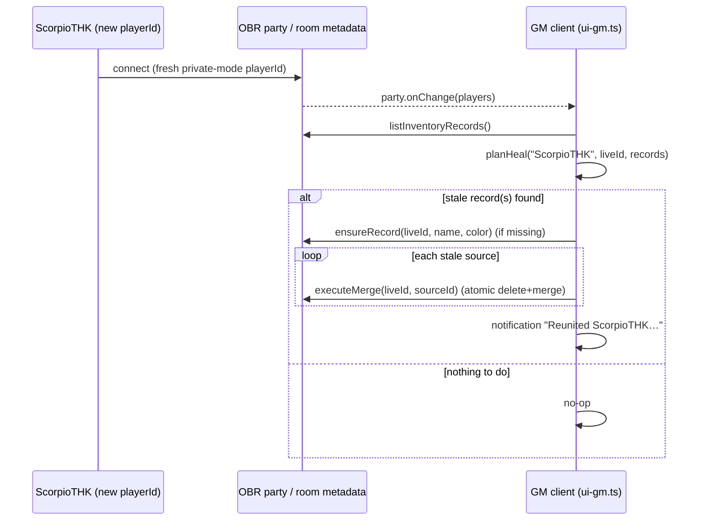

# Auto-heal Inventory on Reconnect — Feature Spec

**Status:** Draft, pending implementation
**Date:** 2026-07-13
**Author:** Adam (with Claude)
**Builds on:** [`2026-05-02-atomic-inventory-updates-design.md`](2026-05-02-atomic-inventory-updates-design.md)

## 1. Purpose

One player (`ScorpioTHK`) plays in a private browser window, so Owlbear Rodeo issues him a **new `playerId` every session**. Inventory records are keyed by `playerId` (`com.abottchen.obr-inv/v1/<playerId>`), so each session his previous record is orphaned and he re-appears as a blank new user. Today the GM manually merges his old record into the new one every single session via the Merge dialog.

The goal is to make this **heal automatically the moment he connects**, from the GM's client, with zero manual steps.

## 2. Goals and non-goals

### Goals

- When `ScorpioTHK` connects, any inventory record(s) carrying his display name are consolidated onto the record keyed by his **current** `playerId`, with no GM interaction.
- The GM gets one brief notification per heal so they know it happened.
- Reuse the existing, tested merge machinery (`mergeRecords` / `executeMerge`) — no new data model, no schema change.
- No player real-names in tracked files (the git forbidden-name hooks must stay green). Only the handle `ScorpioTHK` appears in source.

### Non-goals

- A general, configurable per-player identity system. This is a deliberate, hardcoded special case for one account (see §7). A configurable allowlist / management UI was considered and rejected as over-engineering for a one-person quirk.
- Stable name-based record keys. Records stay keyed by `playerId`; transfers, the GM rail, and the atomic writer stamp are unchanged.
- Healing while the player is offline. The heal only runs when he is present in the party (that is when we know his live `playerId` and color).
- Removing the manual Merge dialog or the player-side claim banner. Both stay as fallbacks.

## 3. Decisions

| Topic | Decision |
|---|---|
| Where it runs | The **GM client only**. `ui-gm.ts` is mounted only for the GM, which is the one client reliably open during play (the affected player rarely opens his own popover). |
| Trigger | `OBR.party.onChange` (fires when a player joins/leaves/renames) **plus one run at GM view mount** (covers the case where he is already connected when the GM opens the extension). |
| Why party, not metadata | Triggering on party changes — not `onMetadataChange` — means the heal's own writes cannot re-trigger it, so there is no write-loop. It also matches the intent ("when he connects") and gives us his live `playerId`/color directly. |
| Identity match | Exact display-name match against `AUTO_HEAL_NAME`, normalized with `.trim().toLowerCase()` on both sides so a stray space or capitalization still matches. |
| Target selection | The record keyed by his **current** (live) `playerId`. If no such record exists yet (he has not opened his popover this session), create a blank one via `ensureRecord(liveId, name, color)` using his live party color, then merge into it. |
| Merge primitive | Existing `executeMerge(targetId, sourceId, opts)` per stale record — atomic source-delete + target-merge in one `atomicMultiUpdate`. |
| Overlay | None. This is a background/boot-time write, so per the project convention it skips `withOverlay` and calls the atomic helper directly with a `description`. |
| Notification | `OBR.notification.show("Reunited ScorpioTHK with their inventory.", "INFO")`, shown **only when at least one merge actually completed**. |
| Race / multi-GM safety | Each `executeMerge` is wrapped in `try/catch`. If a second GM (or a re-fire) already deleted the source, `executeMerge` throws "Source has no record"; we log and skip. |

## 4. Architecture

Three small pieces:

### 4.1 `src/constants.ts`

```ts
// ScorpioTHK plays in a private browser window, so OBR issues him a new
// playerId every session, orphaning his inventory record. His display name
// is his only stable identifier, so the GM client auto-merges stray records
// with this name onto his live id whenever he (re)connects. See src/heal.ts.
export const AUTO_HEAL_NAME = "ScorpioTHK";
```

### 4.2 `src/heal.ts` (new)

**`planHeal(name, liveId, records)` — pure, unit-testable, no OBR.**

Inputs: the target name, the connected player's live `playerId`, and the full `Record<playerId, PlayerInventoryRecord>` map. Returns `{ targetId, sourceIds } | null`.

Logic:
1. `candidates` = record ids whose `record.name` matches `name` (trimmed, case-insensitive).
2. `sources` = `candidates` excluding `liveId`.
3. If `sources` is empty → return `null` (already consolidated, or he has no records).
4. If `liveId` has **no** record among candidates **and** every source is empty (no items with count > 0 and no currency > 0) → return `null` (nothing worth re-keying; avoids pointless churn for an empty inventory).
5. Otherwise → return `{ targetId: liveId, sourceIds: sources }`.

**`runHeal(players)` — the executor (does IO).**

1. Find the connected player whose name matches `AUTO_HEAL_NAME` (normalized). If none → return (not connected).
2. `records = await listInventoryRecords()`.
3. `plan = planHeal(AUTO_HEAL_NAME, livePlayer.id, records)`. If `null` → return.
4. If `records[livePlayer.id]` is absent → `await ensureRecord(livePlayer.id, livePlayer.name, livePlayer.color)`.
5. For each `sourceId` in `plan.sourceIds`: `try { await executeMerge(plan.targetId, sourceId, { description: "auto-heal reconnect" }) } catch (e) { console.warn(...) }`. Track whether any succeeded.
6. If any merge succeeded → `OBR.notification?.show?.("Reunited ScorpioTHK with their inventory.", "INFO")`.

Concurrency guard: a module-level in-flight flag so overlapping `party.onChange` fires do not run `runHeal` concurrently; if a fire arrives while running, run once more afterward (coalesced). Idempotency makes a redundant run a no-op.

### 4.3 `src/ui-gm.ts` (wiring)

- `const unsubParty = OBR.party.onChange((players) => { void runHeal(players); });`
- One initial run: `void (async () => { runHeal(await OBR.party.getPlayers()); })();`
- Add `unsubParty()` to the existing cleanup return alongside `unsubMeta`, `unsubCustoms`, `unsubBroadcast`.

## 5. Data flow



## 6. Testing

`test/heal.test.ts` (vitest + jsdom, OBR SDK mocked). Mock changes: add `party.onChange` to `test/_mocks/obr-sdk.ts`, and make `__testHooks.setParty` (or a new helper) fire registered party listeners so `onChange` can be exercised.

Cases:
- **`planHeal` unit tests:**
  - No records with the name → `null`.
  - Only the live-id record has the name → `null`.
  - Blank live record + full stale record → `{ targetId: liveId, sourceIds: [stale] }`.
  - No live record + full stale record → re-key plan (`targetId: liveId`, stale as source).
  - No live record + single empty stale record → `null` (no churn).
  - Multiple stale records → all listed as sources.
  - Name match is trim/case-insensitive.
- **`runHeal` integration (through the mock):**
  - Full stale + blank live → after run, one record under live id with merged items/currency, stale deleted, notification shown once.
  - No live record + full stale → live-id record created and populated, stale deleted.
  - Nothing to heal → no writes, no notification.
  - `executeMerge` throwing for one source (source already gone) is caught; the run still completes and heals the rest.

Existing tests (`test/merge.test.ts`, atomic, GM view) must stay green.

## 7. Risks and mitigations

- **Hardcoded handle.** `ScorpioTHK` is a gamertag, not a real name, and does not match the forbidden-name regex (`<first-name> <Capitalized-word>`), so committing it is safe. If he ever changes his display name, the constant must be updated — documented in the constant's comment.
- **Name collision.** If a *different* connected player ever used the exact name `ScorpioTHK`, their record could be absorbed. Accepted: display names are unique in this table, and only this one hardcoded name is ever auto-healed.
- **Empty-inventory churn.** Guarded by `planHeal` step 4 — a lone empty stale record with no live record is left alone rather than re-keyed every session.

## 8. Out of scope / future

If a second player ever adopts private-mode play, revisit the configurable-allowlist approach rather than adding more hardcoded names.
